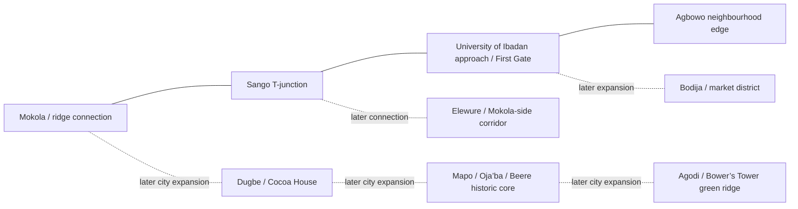

# World & District Plan

**Planning version:** 0.1
**World scale:** Ibadan-inspired geography, with a faithful street/landmark backbone and authored game detail.
**First playable area:** Sango–UI First Gate–Agbowo corridor (exact boundary pending OSM review).

## 1. World promise

The city is one connected place, not a stack of disconnected maps. The first area must have at least two exits that visibly continue toward real Ibadan corridors. Streets, hills, landmarks, markets, homes and player routines are the primary content; a HUD cannot substitute for them. The reference and licensing rules live in [the geographic research document](../research/ibadan-geographic-reference.md).

## 2. First district — Sango / Agbowo / University frontage

### Player-facing identity

A busy, everyday university-edge district: a high-flow junction and transport edge at Sango; a road corridor with small businesses, food stops and service activity; a recognisable University of Ibadan approach; and the dense residential/commercial edge of Agbowo. The slice is not a 1:1 digital twin of the entire university or a generic “African market.” It uses actual route topology and selected anchor placement, while individual businesses/interiors are original fictional content.

### Key spatial beats

1. **Spawn and orientation point:** safe, legible sidewalk pocket just off the junction; sightline toward the UI road; initial camera avoids spawning in traffic.
2. **Sango junction:** asymmetric real branch structure from OSM; visible traffic modes; safe pedestrian crossings; one job/contact point.
3. **Street frontage:** varied shop widths and compounds, open drains/covered crossings, utility poles and overhead wires, small shaded waiting places, kiosks and food stalls. Each cluster is instanced, not a unique high-poly object.
4. **University approach:** gate/edge used as an orientation landmark and social gathering point; no locked gates passed through, no campus access implied where the source/rights do not support it.
5. **Agbowo edge:** small shopping/social hub, residential compound entrances and an alley-to-main-road loop to keep the district traversable.
6. **Outward connections:** Mokola and Elewure-side route continuations load/stream into later cells; do not use a hard invisible wall at a map edge.

### Proposed first-slice boundaries

- Use the provisional AOI GeoJSON only as a **download envelope**.
- In the first map review, choose an approximately **3–4.5 km route span** from Sango toward the UI/Agbowo edge based on the rough reference pins; the actual network distance must be measured from the extracted road graph. If that is too large for the first playable session, make Sango-to-UI the initial slice and stream Agbowo as the first adjacent expansion cell rather than compressing real road distance.
- Preserve real distance/order where possible; if performance or first-session pacing requires a smaller playable footprint, trim low-value block depth/loops—not the relative sequence of Sango, the UI approach and Agbowo.
- The first vertical slice should be small enough that a player can cross the main play loop on foot in a few minutes while taking optional alley routes. Exact route length and boundaries are set after OSM geometry is imported.

## 3. City structure and expansion

This is a **not-to-scale design diagram**, not a measured road map. Road alignment and actual intersections come from the clipped OSM data and local verification; named links are geographic design anchors, not proof that every shown pair has a direct road.

### District roles

| District | Visual/economic identity | Core play hooks | Build order |
|---|---|---|---|
| Sango junction | Traffic, transit, small services and junction energy | Meet players, collect work, locate the first vendor | First |
| Agbowo / UI edge | Student-facing commerce, food, rental compounds and learning/transport frontage | Food, errands, social gathering, modest rental room later | First |
| Mokola connection | Hill/road transition and a route toward the central city | Navigation landmark and first inter-district route | Second |
| Bodija / market | Larger market and commercial logistics | Shop inventory, purchasing/selling, delivery routes | Third |
| Dugbe | Dense commercial centre; Cocoa House silhouette is a skyline anchor | Jobs, offices, transit and social spaces | Fourth |
| Mapo / Oja’ba / Beere | Historic civic/market core, tighter street grain and hilltop composition | Cultural events, markets, public gathering | Fifth |
| Agodi / Bower’s Tower | Green/recreation and elevated view | Park gathering, skyline vista, later leisure loop | Sixth |

## 4. Street and block design rules

- **Road network:** retain the actual graph and local junction geometry; major roads should read differently from small neighbourhood streets. Do not draw one straight road through all blocks for convenience.
- **Road conditions:** vary surface appearance, repair patches, edge wear, drains and shoulder width in ways supported by observation. Do not make every road uniformly broken or uniformly pristine.
- **Walking:** sidewalks are intermittent in the authored world where appropriate, but each essential objective has a safe, visible walking route; alleys reconnect to public streets and never become dead-end trap geometry.
- **Drainage:** use small channels/culverts and crossing slabs near road edges; larger drainage and river forms only when supported by data. No decorative stream cuts through real blocks arbitrarily.
- **Utilities:** poles, streetlights and wire runs use reusable segment assets with varied spacing. Wires are low-poly curves with collision disabled.
- **Intersections:** communicate priority and crossing points through markings/signs/environment composition. Traffic light behavior is lightweight; pedestrians retain safe crossing space.
- **Compounds:** wall, gate, courtyard, verandah and setback variations; open doors signal enterable buildings. Collision should follow the closed gate/wall, not the decorative mesh.
- **Street commerce:** kiosks, shopfronts, market canopies and service bays are authored as varied clusters, with clear walk lanes and accessibility for players.

## 5. Architecture and environmental language

The district art should express a contemporary southwest Nigerian city through a considered mixture: concrete and painted plaster; metal security grilles and gates; low-rise shops and compound houses; hostels/apartments; occasional larger institutional/commercial forms; verandahs, canopies and shade; red/brown earth where exposed; tropical roadside planting; drainage, poles and wires; locally plausible signage and informal service activity. The location should not be reduced to poverty, disorder or decorative stereotypes. Use local review on Yoruba words, cultural references and signs.

The University edge, historic city hall, tower and commercial landmarks are references for future, distinct silhouettes. For the first slice, prioritise accurate Sango geometry and UI frontage rather than spending production time on later-district landmarks.

## 6. 3D and navigation data model

- Source coordinate system: EPSG:4326 (latitude/longitude); projected authoring: EPSG:32631 (metres); runtime origin: local offset near Sango/UI.
- Road graph features: `osm_type`, `osm_id`, `source_tags`, `source_timestamp`, `road_class`, `width_source`, `is_walkable`, `is_driveable`, `cell_id`.
- Building features: source ID and footprint retained in authoring data; runtime building variant, enterability flag, interior ID, collision proxy, LOD list.
- Landmark feature: hand-authored dimensions, source references, in-game name, accessibility/permission note, LOD set.
- Navigation: connected footpath graph and road graph; road edges must connect at every imported junction. Cell boundaries use shared edge IDs so streamed terrain/roads have no gaps.
- Terrain: base DEM elevation resampled and smoothed for mobile; path/crossing correction is authored on top of it. No terrain texture is copied from a basemap.

## 7. Day, night, weather and activity

- **Day/night:** gradual directional-light and sky changes, with the sun direction tied approximately to latitude/time rather than an unrealistic city-wide “lights on” switch. First implementation should be a lightweight local cycle; server time becomes authoritative when multiplayer is added.
- **Weather:** first slice starts with a clear/hazy warm-day preset; rain is a later visual/audio feature after frame-time tests. Rain should not block controls, create costly full-screen post effects, or turn every road into a puddle.
- **Ambient activity:** sound zones and a restrained number of NPC traffic/pedestrian actors; ambient NPCs provide services/atmosphere only and are visually distinct from real online players. Population scales down on weak hardware.
- **Time budget:** for the initial slice, one simulated day can be around 20–30 real minutes, configurable and adjustable after playtests. Avoid needs timers that force constant grinding.

## 8. Streaming and density

- Divide the processed map into ~250 m cells as a starting point; load current and adjacent cells with a small camera buffer.
- Bundle cell geometry by material where possible; instance lamp posts, poles, repeated shop items, trees and street furniture.
- Stream distant block silhouettes first; add detailed props/interiors only as the player approaches.
- Keep interiors as small authored sub-scenes attached to a physical doorway, not a menu teleport. For the vertical slice, one shop interior and one modest room can prove the system.
- Traffic: initially parked cars or a small number of route-following vehicles only if movement is real and collision/path rules are tested. No vehicle is presented as driveable until entry, steering, acceleration, braking, collision and exit all work.

## 9. First-district content checklist

- Sango junction road branches from source; foot routes around it.
- One continuous main street, one quieter parallel/local route and at least two short connectors/alleys.
- A real road/footpath connection to the UI approach and an Agbowo street edge.
- At least 12 authored building clusters (not 12 unique high-poly buildings), with 3 visible typologies and repeatable facade variations.
- One enterable vendor, one work/contact point, one safe social/rest point, and a simple room/interior if time allows.
- Drainage, crossings, poles/wires, street lights, signboards, sidewalk changes, shade and vegetation as reusable assets.
- One tested foot loop and one vehicle road graph, even if player driving is deferred.
- No unrelated districts falsely depicted as neighbouring real places.

## 10. Definition of a successful world slice

A tester can identify Sango and the University/Agbowo edge through layout and landmarks; walk between gameplay destinations without loading-screen cuts; understand where road, sidewalk, alley and entrance are; and reach two visible continuation routes. The geometry has documented sources and deviations. Performance does not require loading the full AOI at once.
