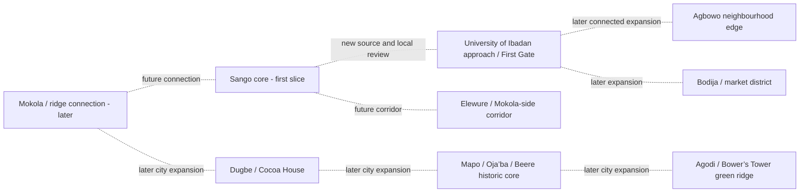

# World & District Plan

**Planning version:** 0.2
**World scale:** a curated, Ibadan-grounded neighbourhood slice, then connected expansion—not a replica of all Ibadan or Oyo State.
**First-area recommendation:** Sango T-junction core, with short approaches on Polytechnic Road and Ijokodo Road.
**Boundary status:** provisional research clip only; not official, playable, or yet locally approved.

## 1. World promise

The city should feel like one connected place, but the first release should make one small part feel lived-in rather than sketching every district. Streets, a few useful destinations, and locally reviewed activity are the primary content; a HUD cannot substitute for them. Future areas connect to Sango only after each new geography is sourced and reviewed. See the [geographic reference](../research/ibadan-geographic-reference.md) and [Lagoslife.app pattern review](../research/lagos-life-reference.md).

## 2. First slice — Sango core

### Geographic footprint and evidence

The current working clip is the WGS84 rectangle `[3.877, 7.423, 3.884, 7.432]`, approximately **0.8 km east–west by 1.0 km north–south** near Sango T-junction. It contains 46 clipped road features from a dated OSM-derived snapshot, including named Polytechnic Road and Ijokodo Road segments. This is enough to plan a small road-first prototype, not enough to claim a complete mapped neighbourhood.

The source snapshot contains roads only. It has no building footprints, verified businesses/POIs, terrain or sidewalk-completeness layer, and its northern extent ends south of the cited Agbowo reference point. The clip does **not** include the full University of Ibadan/Agbowo route. Use the rectangle for research and data processing, then set a walkable gameplay boundary only after GIS and local review.

### Player-facing identity

A compact, busy transport-and-neighbourhood crossroads: a clear Sango arrival point; the distinct main-road approaches; nearby local streets; small, curated places that support a believable first day. The map is not a 1:1 city digital twin or a generic “African market.” Road topology and selected real place relationships should be faithful; individual shops, names and interiors should be fictional unless independently verified and permitted.

### Spatial beats

1. **Spawn/orientation:** a safe sidewalk pocket just off the traffic edge. A short view of the junction gives the player an immediate sense of place.
2. **Sango anchor:** a meeting/transport arrival point, presented as a game destination rather than a claim about current service schedules.
3. **Road identity:** preserve the actual asymmetric branch shape and short Polytechnic Road/Ijokodo Road approaches in the source. Do not redraw the junction as a symmetrical four-way intersection.
4. **Local street loop:** connect one or two quieter roads and short links only where the source geometry supports them. Give essential objectives a clear walking route and safe crossing points.
5. **Curated activities:** begin with three or four useful anchors—a contact/work point, one food/vendor stop, a safe rest/social place, and optionally a small service interior. Use fictional identities until local verification.
6. **Future exits:** show a continuation only where the road actually reaches the reviewed clip edge. UI/Agbowo, Mokola and other districts are later extensions, not claimed playable destinations in this slice.

### Boundary and content limits

- Use the rough Sango–UI envelope only for research; the Sango-core bbox is a compact geometry clip, not an administrative boundary or final playable boundary.
- Design for a short walkable route of roughly a few minutes between three or four destinations, rather than the earlier multi-kilometre Sango–UI–Agbowo corridor.
- Keep UI First Gate and Agbowo out of the first scene. The current road snapshot does not reach the cited Agbowo point.
- Keep the first neighbourhood visually rich through a few carefully made façades, shade, drainage, utility details and activity—not by adding thousands of unverified buildings.
- Preserve a source trace for each real road feature. Label all inferred width, crossings, buildings, businesses and terrain as authored/fictional unless supported by reviewed source data.

## 3. City structure and later expansion

This is **not to scale** and does not assert every shown pair has a direct road. Confirm alignment, route continuity and cell transitions from new geometry and local review before building any expansion.

| Area | Visual/economic identity | Future play hooks | Build order |
|---|---|---|---|
| Sango core | Transport edge, busy junction, small services and local streets | Arrival, first job/contact, food, rest and social meeting | First |
| UI approach / First Gate | University frontage and student-facing activity | Learning/errand routes, gathering and services | Later; new geometry/review required |
| Agbowo edge | Residential/commercial mix and student-facing services | Food, errands, room/rent loop and social hub | Later; new geometry/review required |
| Mokola / Elewure | Road interchange and hill/central-city connection | Navigation and first inter-area route | Later |
| Bodija / Bodija Market | Commercial/market logistics | Shopping, selling and delivery routes | Later |
| Dugbe / Cocoa House | Dense commercial centre and skyline anchor | Office work, services and social spaces | Later |
| Mapo / Oja’ba / Beere | Historic core, civic/market activity and hilltop form | Public gathering and cultural events | Later |
| Agodi / Bower’s Tower | Green/recreation and elevated views | Park gathering and leisure | Later |

## 4. Street and block design rules

- **Road network:** preserve the actual graph, branch angles and relative road hierarchy from reviewed OSM geometry; do not straighten roads or add convenient, unsupported junctions.
- **Unknown dimensions:** mapped width/lanes are sparse. Where tags or local evidence are absent, pick a conservative playable width and record it as an authored estimate—not a survey measurement.
- **Walking:** every essential objective has a visible walking route; alleys reconnect to public streets and do not become dead-end traps. Add crossings only after reviewing actual conflict points.
- **Road appearance:** vary surface, repair, shoulder and drain treatments only as supported by local references; do not stereotype the area as uniformly broken or uniformly pristine.
- **Drainage and utilities:** use small channels, culverts, crossing slabs, poles, wires and lights as reusable assets only where plausible; no unsupported waterways or decorative drains through blocks.
- **Compounds and shops:** use original modular façades, gates, courtyards, verandahs and shaded fronts. Do not infer building height/interior from road-only data.
- **Street commerce:** a few clear kiosks/services support the first loop. Use fictional signage/businesses until current occupancy and local naming are verified.
- **Traffic:** movement and crossings are later polish. Do not present schedules, vehicle routes or transport service details as factual without current evidence.

## 5. Architecture and environmental language

The area should express contemporary southwest Nigerian urban life through a considered mix: concrete and painted plaster; metal grilles and gates; low-rise shops and compounds; occasional hostels/apartments; verandahs, canopies and shade; red/brown earth where exposed; tropical roadside planting; drainage, poles, wires and locally plausible signage. Avoid poverty/disorder as a visual shorthand; show education, work, commerce, family and social life. Use local review for Yoruba words, cultural references, façade details and signs.

## 6. Geometry and navigation data model

- Source coordinates: WGS84/EPSG:4326. Project into UTM Zone 31N/EPSG:32631 for metric authoring; keep a small runtime origin near Sango and preserve the inverse transform.
- For each road: retain `osm_type`, `osm_id`, original tags, snapshot/source ID, road class, width source, walkability/driveability decisions and cell ID. Do not overwrite OSM attributes with design estimates.
- The current GeoJSON clip is not a finished nav graph. Validate intersections, one-way behavior and separated/multiple line parts in GIS; preserve legal and provenance metadata with derivatives.
- Buildings, venues and terrain must have their own source/fictionalization and license records. Footprints do not determine height or façade.
- Use road/foot collision and nav geometry simpler than the visual mesh; test each route between spawn, job/contact, vendor and rest point.
- Start with approximately 250 m streaming cells only after measurement. Keep roads continuous across cells, share edge IDs and test for gaps.

## 7. Activity, streaming and performance

- Start with clear warm-day lighting and limited sound zones. Add weather and day/night only after performance is measured.
- Keep NPCs limited to clearly identified ambience/service roles; never present them as real online players.
- Stream the current and adjacent cells; load detailed props/interiors only near the player. Share materials and instance repeated poles, street furniture and trees.
- The first slice can run without driveable vehicles. A static/animated vehicle is not called driveable unless entry, steering, acceleration, braking, collision and exit all work.

## 8. First-slice content checklist

- One accurate Sango junction and the road features that fit inside the reviewed clip.
- One safe spawn/orientation pocket and one tested foot loop.
- Three or four curated, fictional or locally verified gameplay places: work/contact, vendor/food, rest/social, plus optional service interior.
- A handful of original building clusters, not a wholesale reconstruction of the neighbourhood.
- Reusable curb/road edge, crossing, drain, compound gate, shopfront, shade, pole/wire and vegetation assets only where they fit the reviewed context.
- No claims of UI campus access, Agbowo coverage, mapped building completeness, real-time transit, real online players or driveable vehicles.

## 9. Definition of a successful first world slice

A new tester recognises the Sango setting from its junction/road layout and curated activity points; can walk between spawn, one work/contact point and one vendor/rest destination in a few minutes; understands the street and safe walking route; and sees at most clearly marked future road continuations. Road/data sources, uncertainty and authored deviations are traceable. The project makes no claim to represent all of Ibadan.
